# Yemek Sipariş Sistemi
Staj projesi için Bootstrap, Javascript, JQuery, C#, ASP.NET Core MVC, EF Core ve MSSQL teknolojileri kullanılarak basit bir yemek sipariş uygulaması geliştirilmiştir.

## 1 Proje Amacı
Bu uygulamanın amacı, yemek firmaları ile müşterileri çevrimiçi ortamda bir araya getiren bir web tabanlı yemek sipariş uygulaması tasarlamaktır.

### 1.1 Senaryo
Uygulamada 3 tip kullanıcı vardır. Bunlar sırasıyla yönetici, yemek firması ve müşteridir.

Uygulamanın ilk kullanıcı tipi müşterilerdir. Müşteriler bu uygulama sayesinde kendi civar bölgelerinde hizmet veren yemek firmalarından sipariş verebilir,  
siparişlerinin durumunu takip edebilir, siparişi taşıyan kurye bilgilerine erişebilir. Verdiği siparişleri belli bir süre içerisinde iptal edebilir.   
Siparişlerin ödemesini belirttiği ödeme türüne göre yapabilir. Yemek firmaları hakkında yorumlarda bulunabilir ve oy verebilir.  

Uygulamanın ikinci kullanıcı tipi yemek firmalarıdır. Yemek firmaları bu uygulama sayesinde kendi menülerini, kategorilerini ve yemeklerini oluşturabilir.  
Gelen siparişlerden haberdar olabilir. Siparişleri hazırladıktan sonra siparişlere ait teslimat işlemini başlatabilir. Kendi kuryelerini oluşturabilir. 
Her bir teslimata bir kurye atayabilir, bir kuryeye birden fazla teslimat da atayabilir. Teslimat işlemini sonlandırabilir. 
Teslimat yaptığı ve sipariş aldığı bölgeleri belirleyebilir. Belirlediği bölgeler haricinde sipariş alamaz. Sipariş ödemelerini alabilir. 

Uygulamanın son kullanıcı tipi yöneticilerdir. Yöneticiler, müşterileri, firmaları ve firmalara ait ürünleri ve kuryeleri görüntüleme, silme gibi yetkilere sahiptir.   
Uygulamaya dahil olmak isteyen firmaların başvurularını onaylayabilir veya reddedebilir. Siparişlerden ve teslimatlardan haberdar olabilir.   

### 1.2 İş Kuralları
- Bir kullanıcı yalnızca bir role sahiptir, bir rol ise çok sayıda kullanıcıya verilebilir.
- Her bir rol, rol kodu ve rol adı bilgilerini içermelidir.
- Her bir kullanıcının ad, soyad, kullanıcı kodu, rol kodu, e-posta, telefon numarası, adres, parola ve kart bilgileri bulunmalıdır.
- Bir müşterinin bir veya çok sayıda adres bilgisi olabilir. Aynı şekilde bir adres bir veya çok sayıda müşteriye ait olabilir.
- Bir adres bir il içerir. Bir il bir veya çok sayıda adrese ait olabilir.
- Bir adres bir ilçe içerir. Bir ilçe bir veya çok sayıda adrese ait olabilir.
- Her adres, adres kodu, il kodu, ilçe kodu, mahalle, sokak, apartman adı (Bina), posta kodu, daire numarası, kat, tarif ve etiket (ev, iş yeri, ev-2 vb.) bilgilerini içermelidir.
- Bir müşterinin bir veya çok sayıda kartı olabilir. Bir kart ise yalnızca bir müşteriye aittir.
- Her bir kart, kart kodu, kart ismi, kullanıcı kodu, kart numarası, son kullanma tarihi bilgilerini içermelidir.
-	Bir müşteri bir sepetin içerisinde yalnızca bir firmanın ürünlerini ekleyebilir. Aynı sepet içinde farklı firmalardan ürünler olamaz.
-	Bir müşteri çok sayıda sipariş verebilir. Bir sipariş ise yalnızca bir müşteriye aittir.
-	Bir firma bir veya çok sayıda sipariş alabilir. Bir sipariş yalnızca bir firmaya aittir.
-	Bir siparişin bir ödeme tipi olur. Bir ödeme tipi bir veya çok sayıda siparişte kullanılabilir.
-	Bir sipariş yalnızca bir adresten yapılır. Bir adresten bir veya çok sayıda sipariş verilebilir.
-	Her siparişin sipariş kodu, firma kodu, müşteri kodu, adres kodu, sipariş tarihi, toplam tutar, ödeme tipi bilgileri olmalıdır.
-	Her bir ödeme tipi, tip kodu, tip adı alanlarını içermelidir.
-	Bir sipariş bir veya çok sayıda ürün içerebilir. Aynı şekilde bir ürün 1 veya çok sayıda siparişe dahil olabilir.
- Bir siparişin yalnızca bir ödemesi olur. Bir ödeme yalnızca bir siparişe aittir.
- Bir ödeme yalnızca bir tipte yapılabilir. Bir ödeme tipi bir veya çok sayıda ödemede kullanılabilir.
- Bir ödeme yalnızca bir müşteriye aittir. Bir müşteri bir veya çok sayıda ödeme işlemi gerçekleştirebilir.
- Her bir ödeme, sipariş kodu, müşteri kodu, ödeme tipi, ödenen toplam tutar ve ödeme tarihi bilgilerini içermelidir.
- Bir yemek firması bir adrese sahiptir. Bir adreste yalnızca bir yemek firması bulunur.
- Her bir yemek firması, firma kodu, firma ismi, firma logosu, adres kodu, e-posta, telefon ve şifre bilgilerini içermelidir.
- Her firma kendi kategorilerini oluşturacak. Daha sonra yemeklerini bu kategorilere göre atayacak.
- Bir firma bir veya çok sayıda kategoriye sahip olabilir. Bir kategori ise yalnızca bir firmaya aittir.
- Her bir yemek kategorisi, kategori kodu, kategori adı, firma kodu bilgilerini içermelidir.
-	Bir yemek kategorisi bir veya çok sayıda ürün (yiyecek, içecek, sos vb.) içerebilir. Bir ürün ise yalnızca bir yemek kategorisine aittir.
-	Bir firma bir veya çok sayıda ürün içerebilir. Bir ürün yalnızca bir firmaya aittir.
-	Her bir ürün, ürün kodu, ürün adı, firma kodu, kategori kodu, birim fiyat, resim ve içerik bilgilerini içermelidir.
-	Bir firma bir veya çok sayıda menü oluşturabilir. Bir menü ise yalnızca bir firmaya aittir.
-	Bir menü bir veya çok sayıda ürün içerebilir. Bir ürün bir veya çok sayıda menüye dahil olabilir.
-	Her bir menü, menü kodu, menü adı, firma kodu, resim, fiyat ve detay bilgilerini içermelidir.
-	Bir firma bir veya çok sayıda bölgeye teslimat yapabilir. Aynı şekilde bir bölgeye bir veya çok sayıda firma teslimat yapabilir.
-	Bir firma bir veya çok sayıda teslimat yapabilir. Bir teslimat ise yalnızca bir firmaya aittir.
-	Bir teslimat bir sipariş içindir. Aynı şekilde bir siparişin yalnızca bir tane teslimatı vardır.
-	Bir teslimatı bir kurye götürür. Bir kurye bir veya çok sayıda teslimat götürebilir.
-	Bir teslimat bir adrese götürülür. Bir adrese bir veya çok sayıda teslimat götürülebilir.
-	Bir teslimatın bir durumu olur. Bir durum bir veya çok sayıda teslimata ait olabilir.
-	Her bir teslimat durumu, durum kodu ve durum adı bilgilerini içermelidir.
-	Her bir teslimat, teslimat kodu, firma kodu, sipariş kodu, kurye kodu, adres kodu, durumu, teslimat çıkış tarihi, teslimat varış tarihi bilgilerini içermelidir.
-	Bir kurye yalnızca bir firmaya aittir. Bir firmanın bir veya çok sayıda kuryesi olabilir.
-	Her bir kurye, kurye kodu, firma kodu, ad, soyad, telefon bilgilerini içermelidir.
-	Bir kullanıcı bir veya çok sayıda firmaya yalnızca bir yorum yapabilir.
-	Bir yorum bir kullanıcı tarafından yapılır. Bir kullanıcı bir veya çok sayıda yorum yapabilir.
-	Bir firmaya bir veya çok sayıda yorum yapılabilir. Bir yorum yalnızca bir firmaya aittir.
-	Her bir yorum, yorum kodu, firma kodu, müşteri kodu, yorum ve tarih bilgilerini içermelidir.

### 1.3 Varlık İlişki Diyagramı

## 2 Bazı Sayfalar
### 2.1 Yönetici
<figure>
    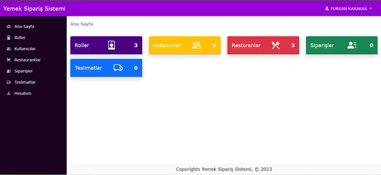
    <figcaption>Yönetici Ana Sayfa</figcaption>
</figure>
<figure>
   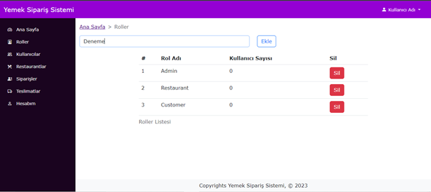
    <figcaption>Yönetici Roller Sayfası</figcaption>
</figure>
<figure>
   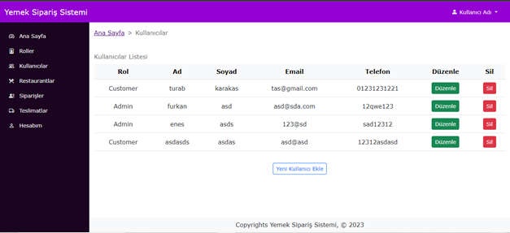
    <figcaption>Yönetici Kullanıcılar Sayfası</figcaption>
</figure>
<figure>
   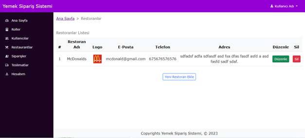
    <figcaption>Yönetici Restoranlar Sayfası</figcaption>
</figure>
<figure>
   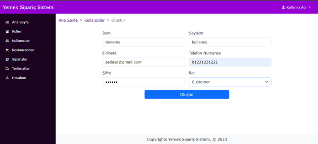
    <figcaption>Yönetici Kullanıcı Ekleme Sayfa</figcaption>
</figure>

### 2.2 Restoran
<figure>
    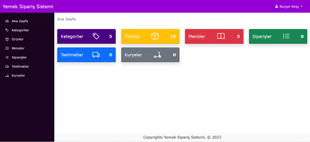
    <figcaption>Restoran Ana Sayfa</figcaption>
</figure>
<figure>
   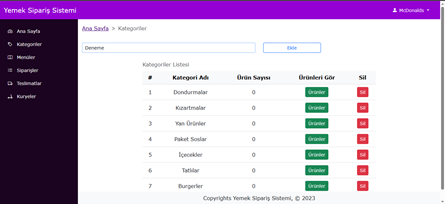
    <figcaption>Restoran Kategoriler Sayfası</figcaption>
</figure>
<figure>
   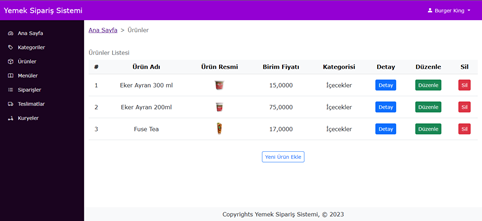
    <figcaption>Restoran Ürünler Sayfası</figcaption>
</figure>
<figure>
   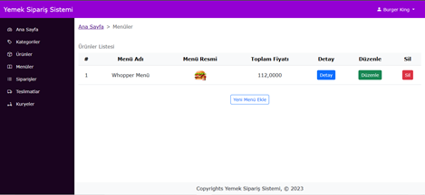
    <figcaption>Restoran Menüler Sayfası</figcaption>
</figure>
<figure>
   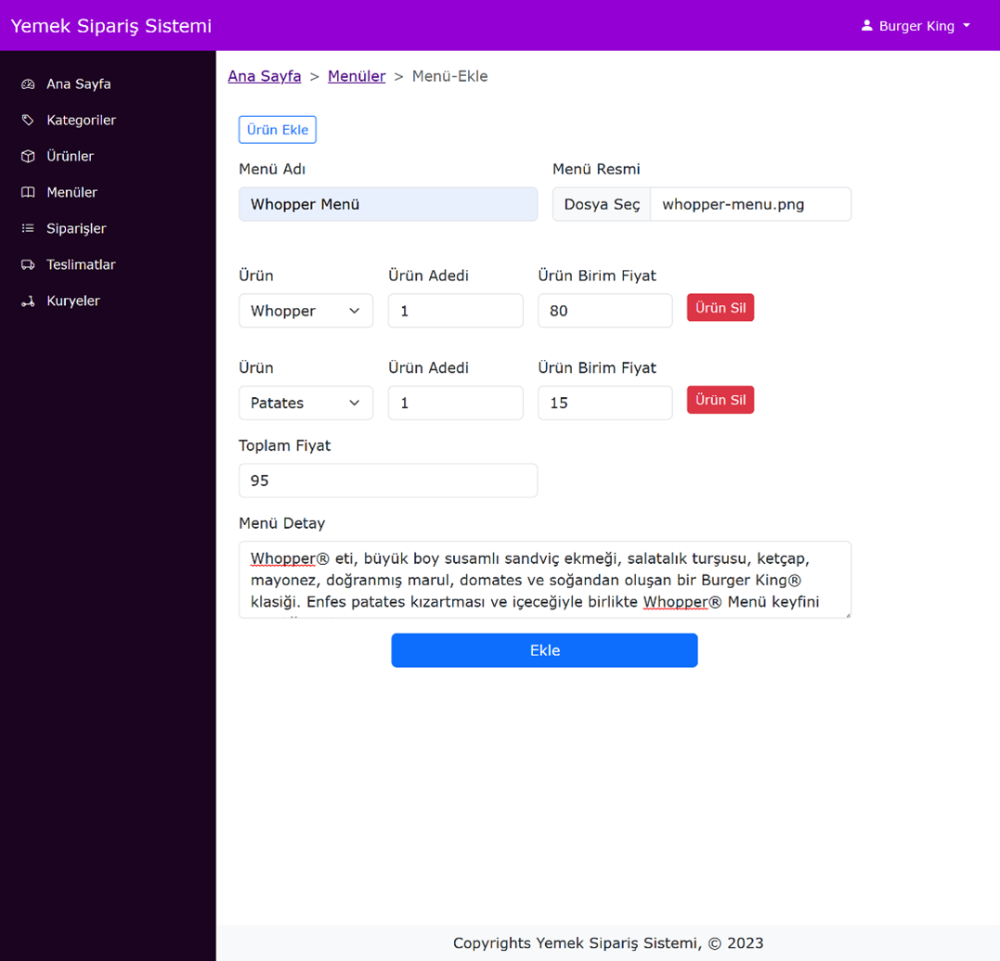
    <figcaption>Restoran Menü Ekleme Sayfası</figcaption>
</figure>

### 2.3 Müşteri
<figure>
    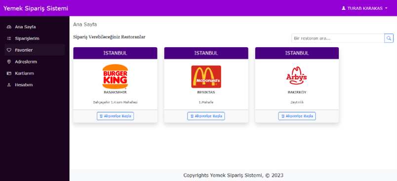
    <figcaption>Müşteri Ana Sayfa</figcaption>
</figure>
<figure>
    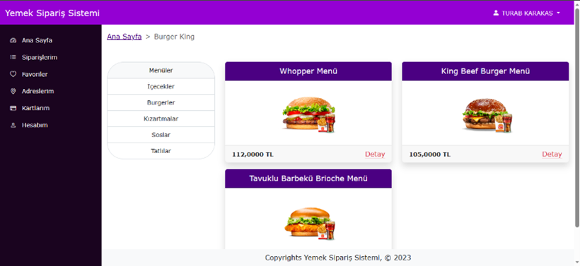
    <figcaption>Müşteri, Restoran Menüler Sayfası</figcaption>
</figure>
<figure>
    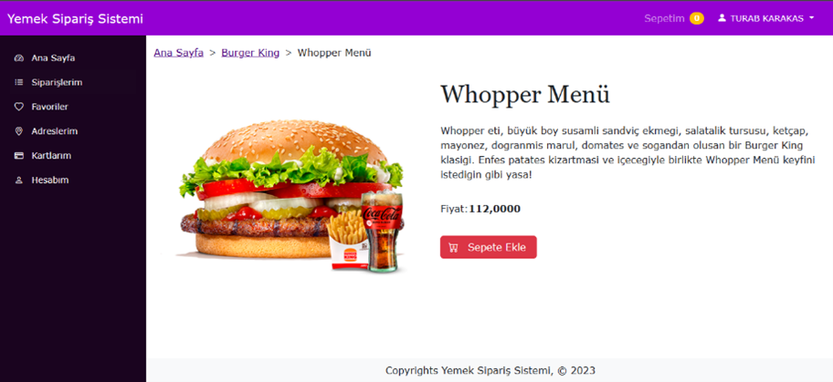
    <figcaption>Müşteri, Restoran Menü Detay Sayfası</figcaption>
</figure>
<figure>
    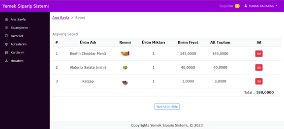
    <figcaption>Müşteri, Alışveriş Listesi</figcaption>
</figure>
